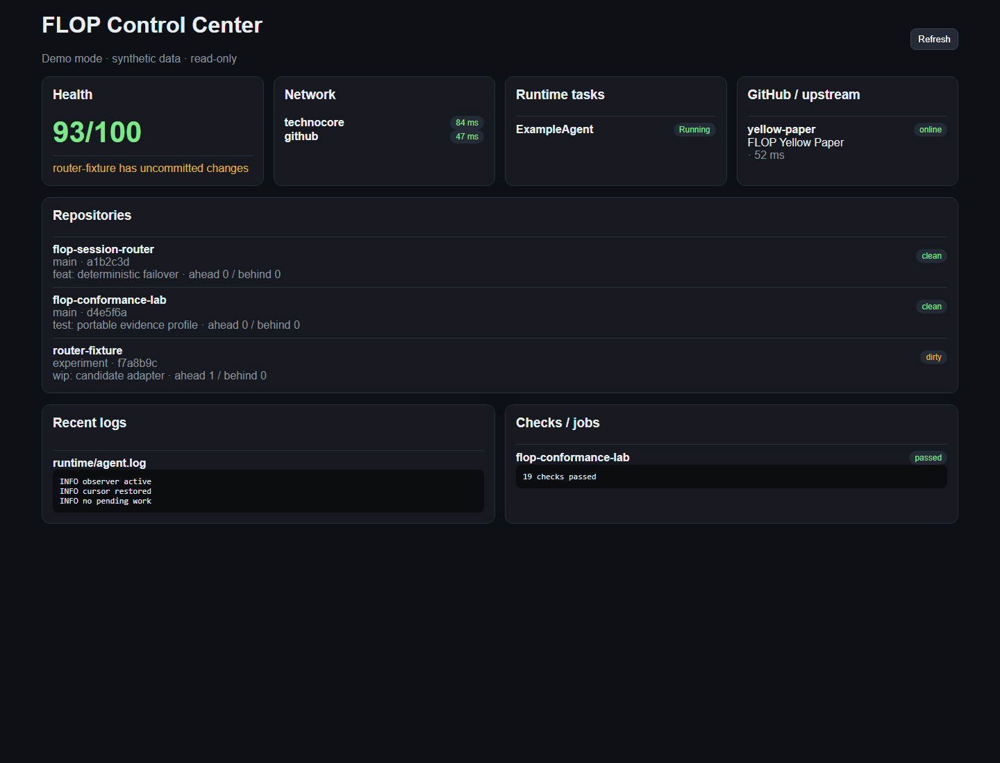

# FLOP Control Center

See your FLOP-oriented development stack in one place.

- repository health and branch/head/dirty state
- background checks and bounded job output
- GitHub/upstream and network health
- recent bounded logs
- reversible allowlisted local controls
- no signing, custody, settlement, or protocol publication

## Try it in 30 seconds

```bash
python server_public.py --demo
```

Open `http://127.0.0.1:8765/`. Demo mode uses synthetic data, loads no local config, and rejects every POST action with `DEMO_READ_ONLY`.



## Use it on a local stack

1. Copy `config/config.example.json` to `config/config.local.json`.
2. Or start from `config/presets/flop-stack.example.json` for a FLOP-oriented stack.
3. Set only your own stack root, repositories, optional targets, logs, task allowlists, and optional continuity journal.
4. Run `python server_public.py`.
5. Open `http://127.0.0.1:8765/`.

Python 3.11+ is recommended; the public-safe core has no third-party Python dependency.

## For agents

Start with [`AGENTS.md`](AGENTS.md), [`SKILL.md`](SKILL.md), and [`llms.txt`](llms.txt). The primary observational endpoint is `GET /api/status`. Reversible actions are allowlisted and intentionally narrow.

## Adoption

External use is tracked in [`ADOPTERS.md`](ADOPTERS.md), separately from stars/forks/self-tests. The versioned public contract is in [`docs/INTEGRATION_CONTRACT.md`](docs/INTEGRATION_CONTRACT.md), with a minimal consumer in [`examples/consume_public_api.py`](examples/consume_public_api.py) and a machine-readable adopter schema in [`schemas/flop-adopter-report-v1.schema.json`](schemas/flop-adopter-report-v1.schema.json).

If you run this independently, submit the **External adopter report** issue template with reproducible bounded evidence and no secrets. Maintainer runs remain `SELF_TEST`; they are never counted as external adoption.

## Safety model

The public surface is deny-by-default. Unknown or unsupported evidence stays unknown/unsupported. Signing, key export, identity custody, protocol publication, autonomous replies, roster consent, settlement, and other irreversible protocol actions are out of scope.

## Maturity

Alpha. The focus is local operational visibility and reversible controls, not remote administration or protocol custody.

## Works with

- [FLOP Conformance Lab](https://github.com/retardio73-boop/flop-conformance-lab) — profile-scoped interoperability evidence. Dashboard health must never be treated as conformance.
- [FLOP Session Router](https://github.com/retardio73-boop/flop-session-router) — deterministic routing, preflight, failover and auditable decisions.

Control Center is the operator surface; Conformance Lab is the evidence surface; Session Router is the routing surface.

## Public autonomy evidence

`GET /api/status` includes a bounded `flop.autonomy-evidence.v1` section. It reports what this instance can actually observe (configured runtime tasks, network targets, and repository state) and explicitly does **not** claim uninterrupted uptime. Design influences and attribution are documented in [`docs/PEER_LEARNINGS.md`](docs/PEER_LEARNINGS.md).

## Durable continuity proof

An optional append-only JSONL journal turns isolated observations into a bounded `flop.continuity-proof.v1` summary: delivered vs expected cycles, duty cycle, worst observed gap, freshness, and boot-id changes. The dashboard only reads this journal; refreshing the UI never creates a continuity record.

Configure:

```json
"continuity": {
  "journal": "runtime/continuity.jsonl",
  "expected_interval_seconds": 900
}
```

Record exactly one cycle from your scheduler/supervisor:

```bash
python tools/record_continuity.py --boot-id runtime-boot-123
```

A missing journal remains `unknown`; stale or sparse evidence is reported as such. Duty cycle is evidence delivery against a configured cadence, not a claim of perfect uptime.

## License

Apache-2.0.
